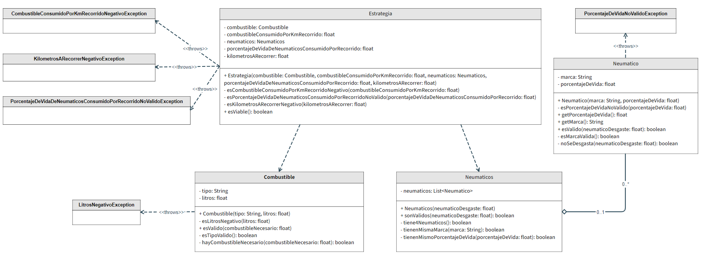

# F1-Test: Testing Project
## Classes
### Combustible
- Responsible for managing fuel
### Neumatico
- Responsible for managing a tyre
### Neumaticos
- Responsible for managing 0 to N tyres
### Estrategia
- Responsible for managing if strategy is valid

## Installation
1. ``mvn clean install`` to install the project dependencies
2. Run Tests for Combustible
3. Run Tests for Neumatico
4. Run Tests for Neumaticos
5. Run Tests for Estrategia
(You can also run all the Tests at the same time)

